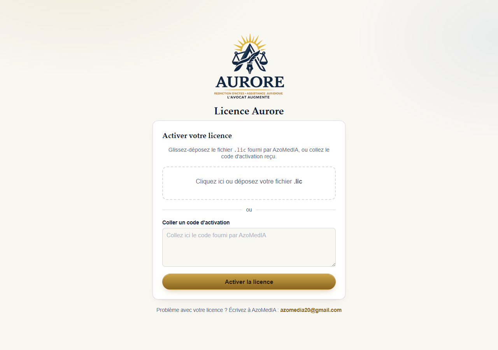
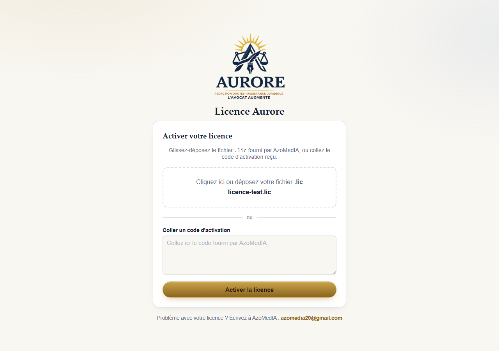
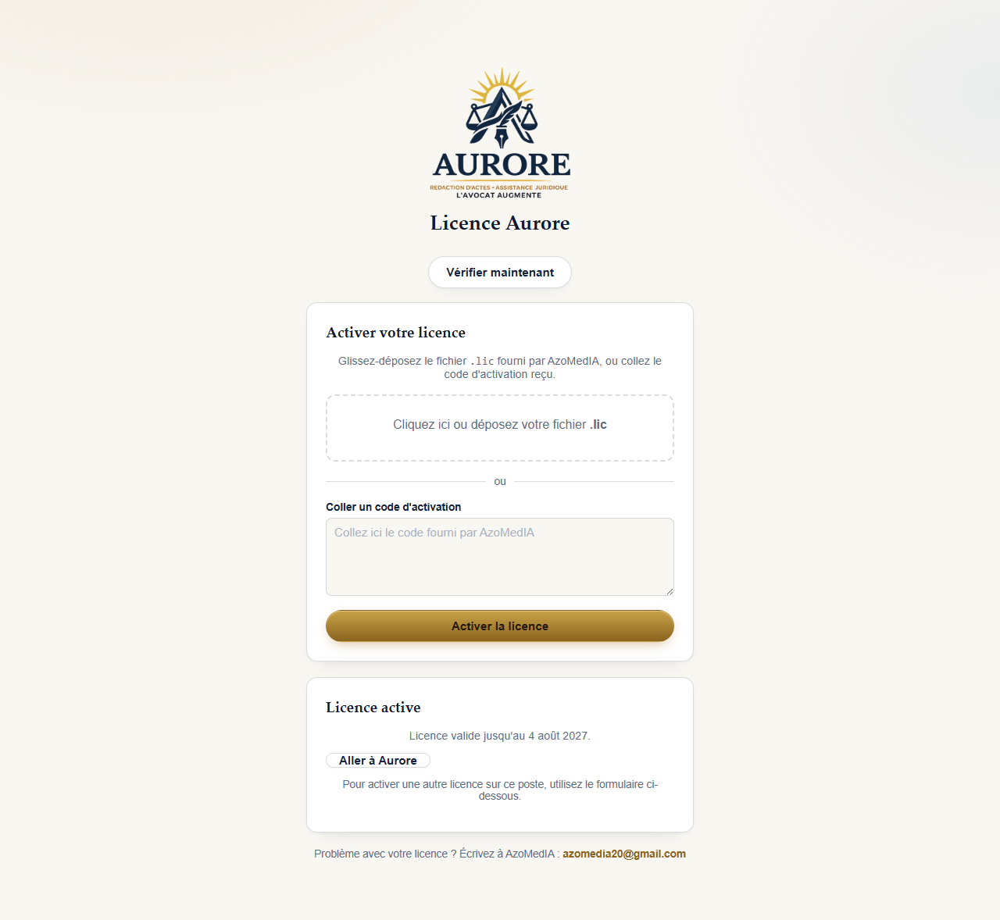
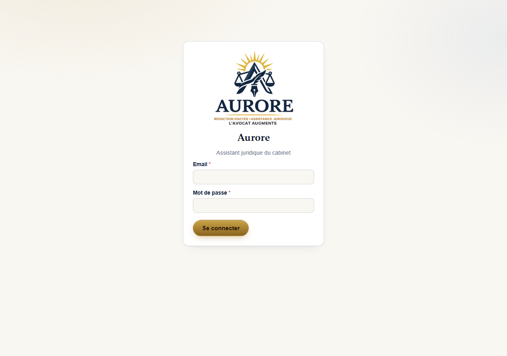

# Activer votre licence Aurore

## Ce qu'il vous faut

Un fichier de licence fourni par AzoMedIA, qui vous a été envoyé par email
lors de votre commande. Ce fichier porte l'extension `.lic` (par exemple
`cabinet-koffi.lic`).

Ce fichier est personnel à votre cabinet et lié à cet ordinateur précis
— ne le transférez pas à un autre cabinet.

## Étape 1 — Trouver l'écran d'activation

Si vous venez d'installer Aurore, cet écran s'affiche automatiquement
après le choix du mode d'utilisation (voir `01-installation.md`).

Si vous devez y revenir plus tard, tapez cette adresse dans la barre
d'Aurore : `http://127.0.0.1:3000/licence.html`

## Étape 2 — Déposer le fichier de licence

Deux façons de faire, au choix :

- **Glisser-déposer** : ouvrez le dossier où se trouve votre fichier
  `.lic` (souvent le dossier "Téléchargements"), et faites-le glisser
  directement dans la zone en pointillés de l'écran Aurore.
- **Cliquer** sur la zone en pointillés pour ouvrir un explorateur de
  fichiers classique, puis sélectionnez votre fichier `.lic`.

Le nom du fichier s'affiche une fois sélectionné.

## Étape 3 — Activer

Cliquez sur le bouton **"Activer la licence"**.

- Si tout va bien, un message vert confirme l'activation, avec la date
  jusqu'à laquelle votre licence est valable.
- Si un message rouge apparaît, voir la section "En cas de problème"
  ci-dessous.

## Étape 4 — Se connecter

Une fois la licence activée, cliquez sur **"Aller à Aurore"**. Vous
arrivez sur la page de connexion, avec l'email et le mot de passe qui
vous ont été communiqués par AzoMedIA (ou par le titulaire de votre
cabinet, s'il a créé votre compte).

## En cas de problème

| Message affiché | Ce que ça veut dire | Que faire |
|---|---|---|
| "Cette licence ne correspond pas à cet ordinateur" | Le fichier `.lic` a été préparé pour un autre ordinateur | Contactez AzoMedIA, en précisant sur quel ordinateur vous installez Aurore |
| "La signature de ce fichier de licence est invalide" | Le fichier a peut-être été modifié ou mal téléchargé | Retéléchargez le fichier `.lic` depuis l'email d'origine, sans l'ouvrir avec un autre programme entre-temps |
| "Votre licence a expiré" | La date de validité est dépassée | Contactez AzoMedIA pour la renouveler |
| Rien ne se passe en cliquant "Activer" | Aucun fichier n'a été réellement déposé | Réessayez le glisser-déposer, ou utilisez le clic pour choisir le fichier manuellement |

## Activer une nouvelle licence plus tard

Si AzoMedIA vous envoie un nouveau fichier `.lic` (par exemple lors d'un
renouvellement), retournez simplement sur l'écran d'activation
(`http://127.0.0.1:3000/licence.html` une fois connecté) et déposez le
nouveau fichier — pas besoin de désinstaller quoi que ce soit.

---

Besoin d'aide ? Écrivez à AzoMedIA : **azomedia20@gmail.com** (lien
également disponible en haut de l'écran de licence et dans le menu
principal d'Aurore une fois connecté).
