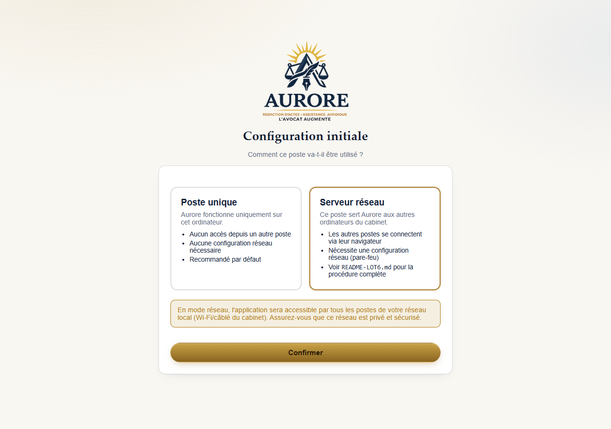

# Utiliser Aurore sur plusieurs ordinateurs du cabinet

Ce guide s'applique si plusieurs personnes de votre cabinet doivent
utiliser Aurore en même temps, depuis des ordinateurs différents, connectés
au même réseau (Wi-Fi ou câble du cabinet).

Si une seule personne utilise Aurore sur un seul ordinateur, ce guide ne
vous concerne pas — passez votre chemin.

## Principe général

Aurore doit être installé une seule fois, sur **un seul ordinateur** qui
restera allumé pendant les heures de travail (l'ordinateur "serveur").
Les autres ordinateurs du cabinet n'installent rien du tout : ils se
connectent simplement avec leur navigateur internet habituel (Chrome,
Edge...), comme pour consulter un site web.

## Sur l'ordinateur qui accueille Aurore

### Étape 1 — Choisir le bon mode au premier lancement

Au tout premier démarrage d'Aurore (voir `01-installation.md`), l'écran
de bienvenue vous propose deux choix :

- **Poste unique** — à ne PAS choisir dans ce cas.
- **Serveur réseau** — c'est celui-ci qu'il faut choisir.



Un message vous rappelle que les autres ordinateurs du réseau pourront
alors accéder à Aurore — assurez-vous que votre réseau Wi-Fi/câblé est
bien celui du cabinet, pas un réseau public.

Cliquez sur **"Confirmer"**, puis fermez et rouvrez Aurore pour que ce
réglage s'applique.

### Étape 2 — Récupérer l'adresse à donner aux autres postes

Une fois Aurore relancé, retournez sur l'écran de configuration (menu
"Paramètres" une fois connecté, ou l'adresse
`http://127.0.0.1:3000/setup-mode.html`). Un encart affiche deux adresses,
par exemple :

```
https://aurore.local:3000
https://192.168.1.42:3000
```

Notez la première (celle qui commence par `aurore.local`) — c'est celle à
communiquer en priorité aux autres postes, elle fonctionne même si
l'adresse numérique de l'ordinateur change plus tard.

`[Capture d'écran : encart "Informations de connexion" avec les deux adresses]`

### Étape 3 — Ouvrir l'accès dans le pare-feu Windows (une seule fois)

Cette étape technique doit être faite une seule fois, avec l'aide de la
personne qui gère l'informatique du cabinet si besoin. Un script est fourni
à cet effet (`firewall-rule.ps1`, installé à côté d'Aurore) : il ouvre
l'accès uniquement pour le réseau privé du cabinet, jamais pour un réseau
public.

## Sur les autres ordinateurs du cabinet

### Étape 1 — Ouvrir l'adresse dans le navigateur

Ouvrez Chrome, Edge ou tout autre navigateur, et tapez l'adresse notée à
l'étape précédente (par exemple `https://aurore.local:3000`).

### Étape 2 — Un avertissement de sécurité apparaît — c'est normal

Votre navigateur affiche un message du type **"Votre connexion n'est pas
privée"**. Ce n'est pas une erreur : Aurore utilise un certificat de
chiffrement "auto-signé" (généré par l'ordinateur du cabinet lui-même,
pas par une autorité extérieure comme pour un site public), ce qui est
normal pour une application interne au cabinet.

`[Capture d'écran : avertissement "Votre connexion n'est pas privée"]`

Pour continuer : cliquez sur **"Paramètres avancés"**, puis sur
**"Continuer vers... (dangereux)"**. Le mot "dangereux" est un vocabulaire
générique du navigateur, pas une alerte réelle dans ce cas précis.

**Pour ne plus voir cet avertissement à chaque fois**, un guide
d'importation du certificat est disponible
(`import-cert-instructions.md`, installé à côté d'Aurore) — demandez à la
personne qui gère l'informatique du cabinet de l'appliquer une fois sur
chaque poste.

### Étape 3 — Se connecter normalement

Une fois l'avertissement passé, vous arrivez sur la page de connexion
d'Aurore, exactement comme sur l'ordinateur principal. Connectez-vous avec
votre compte habituel.

## Questions fréquentes

**L'ordinateur "serveur" doit-il rester allumé ?**
Oui, pendant les heures où le cabinet doit pouvoir utiliser Aurore depuis
les autres postes.

**Peut-on changer quel ordinateur est le "serveur" plus tard ?**
Oui, mais cela demande une réinstallation sur le nouvel ordinateur —
contactez AzoMedIA pour être accompagné.

**Un poste client peut-il aussi fonctionner sans réseau ?**
Non : en mode réseau, les autres postes n'ont pas leurs propres données,
tout est centralisé sur l'ordinateur serveur. Sans réseau, ils ne peuvent
pas accéder à Aurore.

---

Besoin d'aide pour cette configuration ? Écrivez à AzoMedIA :
**azomedia20@gmail.com**
